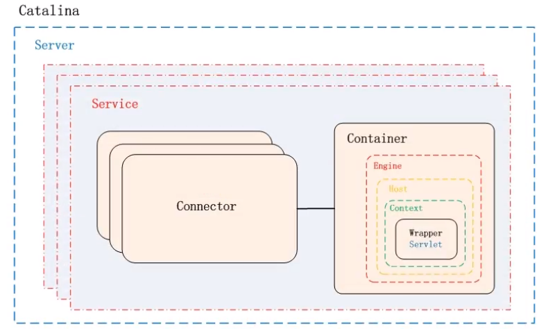
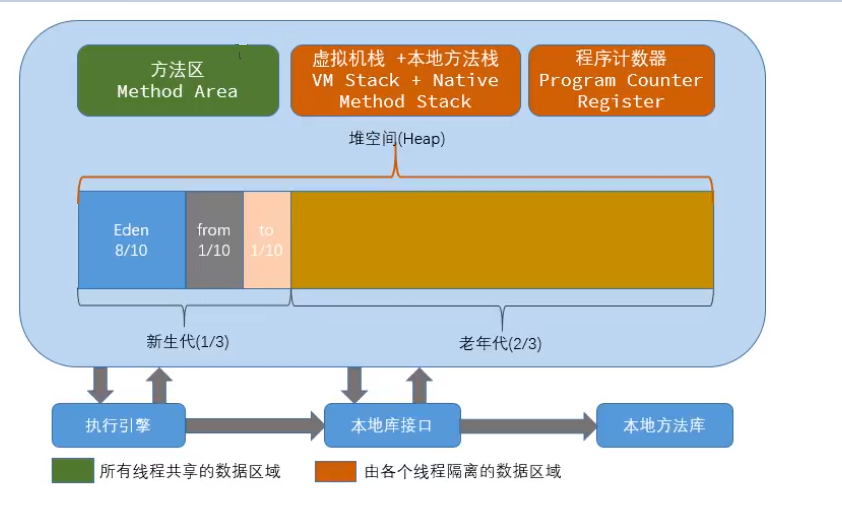
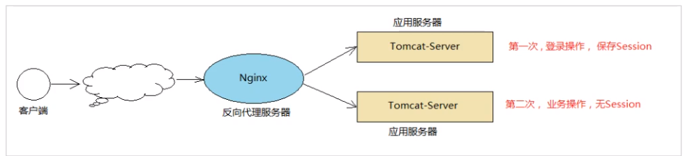

# Tomcat学习


## 源码构建

源码解压后添加文件夹和文件


把conf和webapps移入home文件夹中

pom.xml

```xml
<?xml version="1.0" encoding="UTF-8"?>
<project xmlns="http://maven.apache.org/POM/4.0.0"
         xmlns:xsi="http://www.w3.org/2001/XMLSchema-instance"
         xsi:schemaLocation="http://maven.apache.org/POM/4.0.0 http://maven.apache.org/xsd/maven-4.0.0.xsd">
 
    <modelVersion>4.0.0</modelVersion>
    <groupId>org.apache.tomcat</groupId>
    <artifactId>Tomcat8.5</artifactId>
    <name>Tomcat8.5</name>
    <version>8.5</version>
 
    <build>
        <finalName>Tomcat8.5</finalName>
        <sourceDirectory>java</sourceDirectory>
        <testSourceDirectory>test</testSourceDirectory>
        <resources>
            <resource>
                <directory>java</directory>
            </resource>
        </resources>
        <testResources>
           <testResource>
                <directory>test</directory>
           </testResource>
        </testResources>
        <plugins>
            <plugin>
                <groupId>org.apache.maven.plugins</groupId>
                <artifactId>maven-compiler-plugin</artifactId>
                <version>2.3</version>
                <configuration>
                    <encoding>UTF-8</encoding>
                    <source>1.8</source>
                    <target>1.8</target>
                </configuration>
            </plugin>
        </plugins>
    </build>
 
    <dependencies>
        <dependency>
            <groupId>junit</groupId>
            <artifactId>junit</artifactId>
            <version>4.12</version>
            <scope>test</scope>
        </dependency>
        <dependency>
            <groupId>org.easymock</groupId>
            <artifactId>easymock</artifactId>
            <version>3.4</version>
        </dependency>
        <dependency>
            <groupId>ant</groupId>
            <artifactId>ant</artifactId>
            <version>1.7.0</version>
        </dependency>
        <dependency>
            <groupId>wsdl4j</groupId>
            <artifactId>wsdl4j</artifactId>
            <version>1.6.2</version>
        </dependency>
        <dependency>
            <groupId>javax.xml</groupId>
            <artifactId>jaxrpc</artifactId>
            <version>1.1</version>
        </dependency>
        <dependency>
            <groupId>org.eclipse.jdt.core.compiler</groupId>
            <artifactId>ecj</artifactId>
            <version>4.5.1</version>
        </dependency>
       
    </dependencies>
</project>
```

找到启动类`org.apache.catalina.startup.Bootstrap`中的main方法，在启动配置中加入以下东西

```java
-Dcatalina.home=home
-Dcatalina.base=home
-Djava.util.logging.manager=org.apache.juli.ClassLoaderLogManager
-Djava.util.logging.config.file=E:\idea-workspace\apache-tomcat-learn\home\conf\logging.properties
```


成功启动后访问localhost:8080时会报500错误，此时需要在ContextConfig类的configureStart()方法下面加入以下代码:

```java
  //初始化，引入下面一行代码
        context.addServletContainerInitializer(new JasperInitializer(), null);
```


错误原因：

原因是我们直接启动org.apache.catalina.startup.Bootstrap的时候没有加载org.apache.jasper.servlet.JasperInitializer，从而无法编译JSP。解决办法是在tomcat的源码org.apache.catalina.startup.ContextConfig中的configureStart函数中手动将JSP解析器初始化：

## Tomcat架构

##### Http的工作原理

Http协议时浏览器与服务器之间的数据传送协议，作为应用层协议，Http是基于TCP/IP协议来传递数据的（HTML、图片、查询结果等），Http协议不涉及数据包传输，主要规定了客服端和服务端之间的通信格式。


那我们想要探究的Tomcat和Jetty作为一个HTTP服务器, 在这个过程中都做了些什么事情呢?主要是接受连接、解析请求数据、处理请求
和发送响应这几个步骤。

##### Tomcat的整体架构

Http服务器请求处理

浏览器发给服务端的是一个HTTP格式的请求 , HTTP服务器收到这个请求后, 需要调用服务端程序来处理,所谓的服务端程序就是你写的
Java类,-般来说不同的请求需要由不同的Java类来处理。


1)图1，表示HTTP服务器直接调用具体业务类,它们是紧耦合的。
2)图2 , HTTP服务器不直接调用业务类,而是把请求交给容器来处理,容器通过servlet接口调用业务类。因此servlet接口和servlet容器的出现,达到了HTTP服务器与业务类解耦的目的。而servlet接口和servlet容器这一整套规范叫作servlet规范。
Tomcat按照servlet规范的要求实现了servlet容器,同时它们也具有HTTP服务器的功能。作为Java程序员,如果我们要实现新的业务功能，只需要实现一个servlet ,并把它注册到Tomcat ( Servlet容器)中,剩下的事情就由Tomcat帮我们处理了。

##### Servlet容器工作流程

为了解耦, HTTP服务器不直接调用servlet ,而是把请求交给servlet容器来处理,那servlet容器又是怎么工作的呢?
当客户请求某个资源时, HTTP服务器会用一个servletRequest对象把客户的请求信息封装起来 ,然后调用servlet容器的service方法servlet容器拿到请求后,根据请求的URL和servlet的映射关系,找到相应的servlet ,如果servlet还没有被加载,就用反射机制创建这个servlet , 并调用servlet的init方法来完成初始化,接着调用servlet的service方法来处理请求,把servletResponse对象返回给HTP服务器, HTTP服务器会把响应发送给客户端，


##### Tomcat的整体架构

我们知道如果要设计一个系统，首先是要了解需求,我们已经了解了Tomcat要实现两个核心功能:

1)处理socket连接 ,负责网络字节流与Request和Response对象的转化。
2)加载和管理servlet ,以及具体处理Request请求。
因此Tomcat设计了两个核心组件连接器( Connector )和容器( Container )来分别做这两件事情。连接器负责对外交流,容器负责内部
处理。


## 连接器  - Coyote

##### 架构介绍

Coyote是Tomcat的连接器框架的名称，是Tomcat服务器提供的供客户端访问的外部接口。客户端通过coyote与服务器建立连接、发
送请求并接受响应。
Coyote封装了底层的网络通信( Socket请求及响应处理)。为Catalina容器提供了统-一的接口,使catalina容器与具体的请求协议及IO操作方式完全解耦。Coyote 将socket输入转换封装为Request 对象,交由catalina容器进行处理,处理请求完成后，catalina通过coyote提供的Response 对象将结果写入输出流。
Coyote作为独立的模块,只负责具体协议和IO的相关操作，与servlet 规范实现没有直接关系,因此即便是Request 和Response对象也并未实现servlet规范对应的接口，而是在catalina 中将他们进一步封装为servletRequest 和ServletResponse。


##### 	IO模型与协议

在coyote中， Tomcat支持的多种I/ o模型和应用层协议,具体包含哪些Io模型和应用层协议,请看下表:
Tomcat支持的IO模型(自8.5/9.0版本起, Tomcat移除了对BIO的支持) :


在8.0之前，Tomcat默认采用的I/O方式为BIO，之后改为 NIO。无论 NIO、 NIO2还是APR，在性能方面均优于以往的BIO。如果采用APR， 甚至可以达到Apache HTTP Server 的影响性能。
Tomcat为了实现支持多種I / o模型和应用层协议, 一个容器可能对接多个连接器,就好比一个房间有多个门。但是单独的连接器或者容器都
不能对外提供服务,需要把它们组装起来才能工作,组装后这个整体叫作service组件。这里请你注意, service本身没有做什么重要的事
情，只是在连接器和容器外面多包了一层,把它们组装在一起。Tomcat内可能有多个service ,这样的设计也是出于灵活性的考虑。通过
在Tomcat中配置多个service ,可以实现通过不同的端口号来访问同一台机器上部署的不同应用。

##### 连接器组件


连接器中的各个组件的作用如下:
**EndPoint**
1) EndPoint : Coyote 通信端点,即通信监听的接口,是具体socket接收和发送处理器,是对传输层的抽象,因此EndPoint用来实现TCP/ IP协议的。
2) Tomcat 并没有EndPoint 接口,而是提供了一 个抽象类AbstractEndpoint ，里面定义了两个内部类: Acceptor和SocketProcessor. Acceptor用于监听socket连接请求。SocketProcessor用于处理接收到的socket请求 ，它实现Runnable接口,在Run方法里调用协议处理组件Processor进行处理。为了提高处理能力, socketProcessor被提交到线程池来执行。而这个线程池叫作执行器( Executor) , 我在后面的专栏会详细介绍tomcat如何扩展原生的Java线程池。

**Processor**
Processor : Coyote 协议处理接口, 如果说EndPoint是用来实现TCP/ Ip协议的,那么Processor用来实现HTTP协议,Processor接收来自EndPoint的socket ,读取字节流解析成Tomcat Request和Response对象 ,并通过Adapter将其提交到容器处理，Processor是对应用层协议的抽象。

**ProtocolHandler**
ProtocolHandler : Coyote 协议接口，通过Endpoint 和Processor ，实现针对具体协议的处理能力。Tomcat 按照协议和I/O提供了6个实现类: AJpNioProtocel ， AJpAprProtocol, AJpNio2Protocol ， Http11NioProtocol ,Http11Nio2Protocol , Http11AprProtocol.我们在配置tomcat/conf/server.xml时，至少要指定具体的ProtocolHandler，当然也可以指定协议名称，如: HTTP/1.1 , 如果安装了APR,那么将使用Http11AprProtocol，否则使用Http11NioProtocol.

**Adapter**
由于协议不同,客户端发过来的请求信息也不尽相同, Tomcat定义了自己的Request类来“存放"这些请求信息。ProtocolHandler接口负责解析请求并生成tomcat Request类。 但是这个Request对象不是标准的servletRequest ,也就意味着,不能用tomcat Request作为参数来调用容器。Tomcat设计者的解决方案是引入coyoteAdapter ,这是适配器模式的经典运用,连接器调用coyoteAdapter的Sevice方法,传入的是Tomcat Request对象 ，CoyoteAdapter负责将Tomcat Request转成ServletRequest ,再调用容器的Service方法。

## 容器 - Catalina

Tomcat是一个由一系列可配置的组件构成的web容器 ,而Catalina是Tomcat的servlet容器。
Catalina是servlet 容器实现,包含了之前讲到的所有的容器组件,以及后续章节涉及到的安全、会话、集群、管理等servlet容器架构的各个方面。它通过松耦合的方式集成coyote ,以完成按照请求协议进行数据读写。同时,它还包括我们的启动入口、Shel1程序等。

##### Catalina  地位

tomcat的模块分层结构如下


Tomcat本质上就是一款Servlet 容器，因此catalina 才是Tomcat 的核心，其他模块都是为Catalina 提供支撑的。比如
:通过coyote模块提供链接通信, Jasper 模块提供JSP引擎, Naming 提供JNDI服务, Juli提供日志服务。

##### Catalina 的结构

Catalina 主要的组件结构如下：



如上图所示, Catalina负责管理server ,而server表示着整个服务器。server 下面有多个服务service ,每个服务都包含着多个连接
器组件connector ( coyote实现)和一一个容器组件container。在Tomcat 启动的时候，会初始化一 个catalina的实例。
Catalina各个组件的职责:  


##### Container结构

Tomcat设计了4种容器,分别是Engine、Host、 Context和wrapper这4种容器不是平行关系，而是父子关系。 Tomcat通过一 种分
层的架构,使得servlet容器具有很好的灵活性。


各个组件的含义


我们也可以再通过Tomcat的server . xml配置文件来加深对tomcat容器的理解。Tomcat采用 了组件化的设计,它的构成组件都是可配置
的，其中最外层的是server ,其他组件按照一定的格式要求配置在这个顶层容器中。


那么, Tomcat是怎么管理这些容器的呢?你会发现这些容器具有父子关系,形成一个树形结构 ,你可能马上就想到了设计模式中的组合模
式。没错, Tomcat就是用组合模式来管理这些容器的。具体实现方法是,所有容器组件都实现了container接口,因此组合模式可以使得
用户对单容器对象和组合容器对象的使用具有一致性。 这里单容器对象指的是最底层的wrapper ,组合容器对象指的是上面的context、
Host或者Engine.


在Container的接口中可以看到getParent、setParent、 addChild和removeChild等方法。
Container接口扩展了LifeCycle接口, LifeCycle接口用来统一管理各组件的生命周期 ,后面我也用专门的篇幅去详细介绍。

## Tomcat启动流程

##### 流程


步骤:
1)启动tomcat ，需要调用bin/startup.bat (在Linux目录下，需要调用bin/startup.sh) ，在startup.bat 脚本中，调
用了catalina .bat.
2)在catalina.bat 脚本文件中,调用了Bootstrap中的main方法。
3)在Bootstrap的main方法中调用了init 方法，来创建catalina 及初始化类加载器。
4 )在Bootstrap的main方法中调用了load 方法，在其中又调用了catalina的load方法。
5)在catalina的load方法中，需要进行一些初始化的工作，并需要构造Digester 对象，用于解析XML。
6)然后在调用后续组件的初始化操作。。。

加载Tomcat的配置文件,初始化容器组件, 监听对应的端口号，准备接受客户端请求。

##### 源码解析

**LifeCycle**

由于所有的组件均存在初始化、启动、停止等生命周期方法,拥有生命周期管理的特性，所以Tomcat在设计的时候，基于生命周期管理抽象成了一个接口Lifecycle , 而组件server、 service、 Container、 Executor、 Connector 组件，都实现了一个生命周期的接口,从而具有了以下生命周期中的核心方法:
1) init( ) :初始化组件
2) start( ) :启动组件
3) stop( ) :停止组件
4) destroy( ) :销毁组件


##### 各组件的默认实现

上面我们提到的server. service、 Engine、 Host、 Context都是接口， 下图中罗列了这些接口的默认实现类。 当前对于Endpoint组件来
说,在Tomcat中没有对应的Endpoint接口，但是有一一个抽象类AbstractEndpoint , 其下有三个实现类: NioEndpoint、Nio2Endpoint、AprEndpoint ，这三个实现类,分别对应于前面讲解链接器Coyote 时，提到的链接器支持的三种Io模型 : NIO,NIO2 , APR，Tomcat8 .5版本中,默认采用的是NioEndpoint.


ProtocolHandler : Coyote协议接口 ,通过封装Endpoint和processor， 实现针对具体协议的处理功能。 Tomcat按照协议和IO提供了
6个实现类。
AJP协议:
1) AjpNioProtocol :采用NIO的IO模型。
2) AjpNio2Protocol :采用NIO2的IO模型。
3) AjpAprProtocol : 采用APR的IO模型,需要依赖于APR库。
HTTP协议:
1) Http11NioProtocol : 采用NIO的IO模型，默认使用的协议(如果服务器没有安装APR)。
2) Http11Nio2Protocol :采用NIO2的IO模型。
3) Http11AprProtocol : 采用APR的IO模型,需要依赖于APR库。


##### 源码入口

`类org.apache.catalina.startup.Bootstrap`的main方法

```java
 public static void main(String args[]) {

        synchronized (daemonLock) {
            if (daemon == null) {
                // Don't set daemon until init() has completed
                Bootstrap bootstrap = new Bootstrap();
                try {
                    bootstrap.init();
                } catch (Throwable t) {
                    handleThrowable(t);
                    t.printStackTrace();
                    return;
                }
                daemon = bootstrap;
            } 
        }
```

##### 总结：

从启动流程图中以及源码中,我们可以看出Tomcat的启动过程非常标准化，统按照生命周期管理接口Lifecycle的定义进行启动。 首先
调用init()方法进行组件的逐级初始化操作,然后再调用start ()方法进行启动。
每一级的组件除了完成自身的处理外,还要负责调用子组件响应的生命周期管理方法，组件与组件之间是松耦合的,因为我们可以很容易的
通过配置文件进行修改和替换。

## Tomcat请求处理流程

##### 请求流程

设计了这么多层次的容器, Tomcat是怎么确定每一个请求应该由哪个wrapper容器里的servlet来处理的呢?答案是：Tomcat是用Mapper组
件来完成这个任务的。
Mapper组件的功能就是将用户请求的URI定位到一个servlet ,它的工作原理是: Mapper组件里保存了Web应用的配置信息,实就是容器组
件与访问路径的映射关系，比如Host容器里配置的域名、Context 容器里的web应用路径，以及wrapper容器里servlet映射的路径，你可以
想象这些配置信息就是一个多层次的Map。
当一个请求到来时, Mapper组件通过解析请求URI里的域名和路径,再到自己保存的Map里去查找，就能定位到一个servlet。 请你注意,一个请求URL最后只会定位到一个wrapper容器,也就是一个servlet。
下面的示意图中， 就描述了当用户请求链接`http://localhost/user/findAll `之后， 是如何找到最终处理业务逻辑的servlet。


那上面这幅图只是描述了根据请求的URI如何查找到需要执行的servlet，那么下面我们再来解析- 下，从Tomcat的设计架构层面来分析
Tomcat的请求处理。


步骤如下:
1) Connector组件Endpoint中的Acceptor监听客户端套接字连接并接收Socket。
2)将连接交给线程池Executor处理 ,开始执行请求响应任务。
3) Processor组件读取消息报文 ,解析请求行、请求体、请求头,封装成Request对象。
4) Mapper组件根据请求行的URL值和请求头的Host值匹配由哪个Host容器、 Context容器、Wrapper容器处理请求。

5)CoyoteAdaptor组件负责将Connector组件和Engine容器关联起来，把生成的Request对象和响应对象Response传递到Engine容器

##### 请求流程源码解析


在前面所讲解的Tomcat的整体架构中，我们发现ITomcat中的各个组件各司其职，组件之间松耦合，确保了整体架构的可伸缩性和可拓展性，那么在组件内部，如何增强组件的灵活性和拓展性呢？在Tomcat中 ，每个container组件采用责任链模式来完成具体的请求处理。
在Tomcat中定义了Pipeline和valve两个接口, Pipeline用于构建责任链，后者代表责任链上的每个处理器。Pipeline 中维护了一个基础的valve ,它始终位于Pipeline的末端(最后执行) , 封装了具体的请求处理和输出响应的过程。当然,我们也可以调用addValve()方法，为pipeline 添加其他的Valve，后添加的valve 位于基础的valve之前,并按照添加顺序执行。Pipiline通过获得首个valve来启动整合链条的执行。

## 3、Jesper

##### 3.1 、Jsper的简介

对于基于JSP的web应用来说,我们可以直接在Jsp页面中编写Java代码，添加第三方的标签库，以及使用EL表达式。但是无论经过何种形式的处理，最终输出到客户端的都是标准的HTML页面(包含js , css... ) ，并不包含任何的java相关的语法。也就是说，我们可以把jsp看
做是一种运行在服务端的脚本。那么服务器是如何将Jsp页面转换为HTMI页面的呢 ?
Jasper模块是Tomcat的JSP核心引擎，我们知道JSP本质上是一个servlet。 Tomcat使用Jasper对Jsp语法进行解析 ,生成servlet并生成
Class字节码,用户在进行访问Jsp时，会访问servlet ，最终将访问的结果直接响应在浏览器端。另外，在运行的时候，Jasper还会检测
Jsp文件是否修改，如果修改，则会重新编译Jsp文件。

##### 3.2 Jesper的编译方式

###### 3.2.1 运行时编译

Tomcat并不会在启动web应用的时候自动编译JSP文件，而是在客户端第一次请求时，才编译需要访问的Jsp文件。


3.2.2 编译过程

Tomcat在默认的web.xml中配置了一个org.apache.jasper.servlet.JspServlet 用于处理所有的.jsp或.jspx 结尾的请求，
该servlet实现即是运行时编译的入口。


JspServlet 处理流程图

```jsp
<%@ page contentType="text/html;charset=UTF-8" language="java" %>
<%@ page import="java.text.SimpleDateFormat" %>
<%@ page import="java.util.Date" %>
<%@ taglib prefix="c" uri="http://java.sun.com/jsp/jstl/core" %>
<html>
<head>
    <title>$Title$</title>
</head>
<body>
<%
    SimpleDateFormat dateFormat = new SimpleDateFormat("yyyy-MM-dd HH:mm:ss");
    String time = dateFormat.format(new Date());
%>
<h1>Hello Java Server Page</h1>
<hr/>
<%=time%>
</body>
</html>
```


1)如果在tomcat/conf/web.xml 中配置了参数scratchdir，则jsp编译后的结果,就会存储在该目录下。

```java
<init-param>
<par am- name>scratchdir</param-name>
<param-value>D: / tmp/ jsp/</param -value>
</init-param>
```


2)如果没有配置该选项，则会将编译后的结果存储在Tomcat安装目录下的work/Catalina (Engine名称) /localhost (Host名
称)/Context名称。假设项目名称为 jsp_ demo，默认的目录为 : work/Catalina/localhost/jsp_demo
3)如果使用的是IDEA开发工具集成Tomcat访问web工程中的jsp ， 编译后的结果，存放在:work目录下

###### 3.2.2

除了运行时编译,我们还可以直接在Web应用启动时，一次性将Web应用中的所有的Jsp页面一 次性编译完成。在这种情况下, Web应用运行过程中,便可以不必再进行实时编译,而是直接调用Jsp页面对应的servlet完成请求处理，从而提升系统性能。
Tomcat提供了一个shell程序JspC ，用于支持Jsp预编译，而且在Tomcat的安装目录下提供了一个catalina-tasks.xml文件声明了
Tomcat支持的Ant任务，因此，我们很容易使用Ant 来执行JSP预编译。( 要想使用这种方式,必须得确保在此之前已经下载并安装了
Apache Ant) 。

##### Jsp编译原理

###### 代码分析

编译后的class字节码文件

```java
/*
 * Generated by the Jasper component of Apache Tomcat
 * Version: Apache Tomcat/@VERSION@
 * Generated at: 2020-06-01 14:23:27 UTC
 * Note: The last modified time of this file was set to
 *       the last modified time of the source file after
 *       generation to assist with modification tracking.
 */
package org.apache.jsp;

import javax.servlet.*;
import javax.servlet.http.*;
import javax.servlet.jsp.*;
import java.text.SimpleDateFormat;
import java.util.Date;

public final class index_jsp extends org.apache.jasper.runtime.HttpJspBase
    implements org.apache.jasper.runtime.JspSourceDependent,
                 org.apache.jasper.runtime.JspSourceImports {

  private static final javax.servlet.jsp.JspFactory _jspxFactory =
          javax.servlet.jsp.JspFactory.getDefaultFactory();

  private static java.util.Map<java.lang.String,java.lang.Long> _jspx_dependants;

   //表示引入了那些标签库                  
  static {
    _jspx_dependants = new java.util.HashMap<java.lang.String,java.lang.Long>(2);
    _jspx_dependants.put("/WEB-INF/lib/standard.jar", Long.valueOf(1527555409000L));
    _jspx_dependants.put("jar:file:/E:/idea-workspace/apache-tomcat-learn/home/webapps/servlet_test/WEB-INF/lib/standard.jar!/META-INF/c.tld", Long.valueOf(1098682290000L));
  }

  private static final java.util.Set<java.lang.String> _jspx_imports_packages;

  private static final java.util.Set<java.lang.String> _jspx_imports_classes;
  //引入了那些包
  static {
    _jspx_imports_packages = new java.util.HashSet<>();
    _jspx_imports_packages.add("javax.servlet");
    _jspx_imports_packages.add("javax.servlet.http");
    _jspx_imports_packages.add("javax.servlet.jsp");
    _jspx_imports_classes = new java.util.HashSet<>();
    //依赖了那些类
    _jspx_imports_classes.add("java.util.Date");
    _jspx_imports_classes.add("java.text.SimpleDateFormat");
  }

  private volatile javax.el.ExpressionFactory _el_expressionfactory;
  private volatile org.apache.tomcat.InstanceManager _jsp_instancemanager;

  public java.util.Map<java.lang.String,java.lang.Long> getDependants() {
    return _jspx_dependants;
  }

  public java.util.Set<java.lang.String> getPackageImports() {
    return _jspx_imports_packages;
  }

  public java.util.Set<java.lang.String> getClassImports() {
    return _jspx_imports_classes;
  }

  public javax.el.ExpressionFactory _jsp_getExpressionFactory() {
    if (_el_expressionfactory == null) {
      synchronized (this) {
        if (_el_expressionfactory == null) {
          _el_expressionfactory = _jspxFactory.getJspApplicationContext(getServletConfig().getServletContext()).getExpressionFactory();
        }
      }
    }
    return _el_expressionfactory;
  }

  public org.apache.tomcat.InstanceManager _jsp_getInstanceManager() {
    if (_jsp_instancemanager == null) {
      synchronized (this) {
        if (_jsp_instancemanager == null) {
          _jsp_instancemanager = org.apache.jasper.runtime.InstanceManagerFactory.getInstanceManager(getServletConfig());
        }
      }
    }
    return _jsp_instancemanager;
  }

  public void _jspInit() {
  }

  public void _jspDestroy() {
  }

  //由 HttpJspBase 类的service方法调用
   /*
    @Override
    public final void service(HttpServletRequest request, HttpServletResponse response)
        throws ServletException, IOException
    {
        _jspService(request, response);
    }
   */
  public void _jspService(final javax.servlet.http.HttpServletRequest request, final javax.servlet.http.HttpServletResponse response)
      throws java.io.IOException, javax.servlet.ServletException {

    final java.lang.String _jspx_method = request.getMethod();
    if (!"GET".equals(_jspx_method) && !"POST".equals(_jspx_method) && !"HEAD".equals(_jspx_method) && !javax.servlet.DispatcherType.ERROR.equals(request.getDispatcherType())) {
      response.sendError(HttpServletResponse.SC_METHOD_NOT_ALLOWED, "JSP 只允许 GET、POST 或 HEAD。Jasper 还允许 OPTIONS");
      return;
    }

    final javax.servlet.jsp.PageContext pageContext;
    javax.servlet.http.HttpSession session = null;
    final javax.servlet.ServletContext application;
    final javax.servlet.ServletConfig config;
    javax.servlet.jsp.JspWriter out = null;
    final java.lang.Object page = this;
    javax.servlet.jsp.JspWriter _jspx_out = null;
    javax.servlet.jsp.PageContext _jspx_page_context = null;


    try {
      response.setContentType("text/html;charset=UTF-8");
      //获取一些域对象
      pageContext = _jspxFactory.getPageContext(this, request, response,
      			null, true, 8192, true);
      _jspx_page_context = pageContext;
      application = pageContext.getServletContext();
      config = pageContext.getServletConfig();
      session = pageContext.getSession();
      out = pageContext.getOut();
      _jspx_out = out;

      out.write("\n");
      out.write("\n");
      out.write("\n");
      out.write("\n");
      out.write("<html>\n");
      out.write("<head>\n");
      out.write("    <title>$Title$</title>\n");
      out.write("</head>\n");
      out.write("<body>\n");

    SimpleDateFormat dateFormat = new SimpleDateFormat("yyyy-MM-dd HH:mm:ss");
    String time = dateFormat.format(new Date());

      out.write("\n");
      out.write("<h1>Hello Java Server Page</h1>\n");
      out.write("<hr/>\n");
      out.print(time);
      out.write("\n");
      out.write("</body>\n");
      out.write("</html>\n");
    } catch (java.lang.Throwable t) {
      if (!(t instanceof javax.servlet.jsp.SkipPageException)){
        out = _jspx_out;
        if (out != null && out.getBufferSize() != 0)
          try {
            if (response.isCommitted()) {
              out.flush();
            } else {
              out.clearBuffer();
            }
          } catch (java.io.IOException e) {}
        if (_jspx_page_context != null) _jspx_page_context.handlePageException(t);
        else throw new ServletException(t);
      }
    } finally {
      _jspxFactory.releasePageContext(_jspx_page_context);
    }
  }
}
```

1)其类名为index_ jsp ，继承自`org.apache.jasper.runtime.HttpJspBase` ，该类是HttpServlet的子类， 所以jsp本质就是一个Servlet 。
2)通过属性 jspx_dependants 保存了当前Jsp页面依赖的资源，包含引入的外部的Jsp页面、 导入的标签、标签所在的jar包等,便于后续处理过程中使用(如重新编译检测,因此它以Map形式保存了每个资源的上次修改时间)。
3)通过属性  jspx_imports_packages 存放导入的java 包，默认导入javax.servlet ，javax.servlet.http.javax.servlet.jsp。
4)通过属性    jspx_imports_classes 存放导入的类，通过import指令导入的DateFormat 、simpleDateFormat 、Date都会
包含在该集合中。 jspx_imports packages和. jispx_imports_ classes 属性主要用于配置 EL引擎上下文。*
5)请求处理由方法_ jspService 完成，而在父类HttpJspBase 中的service方法通过模板方法模式，调用了子类的
_jspService方法。

6)_ jspservice 方法中定义了几个重要的局部变量 : pageContext 、session、 application、 config、 out、 page。 由于整个页面的输出有_ jspservice 方法完成,因此这些变量和参数会对整个Jsp顶面生效。这也是 我们为什么可以在Jsp页面使用这些变量的原因。
7)指定文档类型的指令(page) 最终转换为response.setContentType()方法调用。
8)对于每一行的静态内容( HTML) ，调用out.write输出。

```java
  public final void service(HttpServletRequest request, HttpServletResponse response)
        throws ServletException, IOException
    {
        _jspService(request, response);
    }
```


Compiler编译工作主要包含代码生成和编译两部分:
代码生成
1) Compiler 通过一个PageInfo 对象保存JSP页面编译过程中的各种配置,这些配置可能来源于web 应用初始化参数，也可能来源于
Jsp 页面的指令配置(如page，include) 。
2)调用BarserController 解析指令节点，验证其是否合法,同时将配置信息保存到pageInfo中，用于控制代码生成。
3)调用parserController 解析整个页面，由于JSP是逐行解析 ，所以对于每一 行会创建一 个具体的Node 对象。如静态文本
( TemplateText )、Java代码( Scriptlet).定制标签( CustomTag)、Include指令( IncludeDirective )。
4 )验证除指令外其他所有节点的合法性，如脚本、定制标签、EL表达式等。
5)收集除指令外其他节点的页面配置信息。
6)编译并加载当前JSP页面依赖的标签
7)对于JsP页面的EL表达式,生成对应的映射函数。
8 )生成JsP页面对应的servlet 类源代码

**编译**
代码生成完成后，Compiler 还会生成SMAP信息。如果配置生成 SMAP信息，Compiler则会在编译阶段将SMAP信息写到class文
件中。
在编译阶段，Compiler 的两个实现AntCompiler和JDTCompiler分别调用先关框架的API进行源代码编译。
对于AntCompiler 来说，构造一个 Ant的javac 的任务完成编译。

## 4、Tomcat服务器的配置

Tomcat服务器的配置主要集中于tomcat/conf 下的catalina.policy、catalina.properties、context.xml、server.xml
tomcat-users.xml、web.xml文件。

##### 4.1 server.xml
server.xml是tomcat 服务器的核心配置文件,包含了Tomcat的servlet 容器( Catalina )的所有配置。由于配置的属性特别多,我
们在这里主要讲解其中的一部分重要配置。
###### 4.1.1 Server

Server是server.xml的根元素，用于创建一个server实例， 默认使用的实现类是org. apache.catalina.core.Standardserver

```xml
<Server port="8005” shutdown="SHUTDOWN">
 </Server>
```


port : Tomcat 监听的关闭服务器的端口。
shutdown:关闭服务器的指令字符串。

Server内嵌的子元素为Listener、 GlobalNamingResources、 Service.

默认配置5个监听器的含义

```xml
  <!-- 用于以日志的形式输出操作系统，JVM等版本信息 -->  
  <Listener className="org.apache.catalina.startup.VersionLoggerListener" />
  <!--用于加载(服务器启动)和销毁( 服务器停止) APR。 如果找不到APR库 ，则会输出日志 ，并不影响T omcat启动 -->
  <Listener className="org.apache.catalina.core.AprLifecycleListener" SSLEngine="on" />
  <!-- 用于避免JRE内存泄漏-->
  <Listener className="org.apache.catalina.core.JreMemoryLeakPreventionListener" />
  <!-- 用户加载(服务器启动)和销毁(服务器停止)全局命名服务-->
  <Listener className="org.apache.catalina.mbeans.GlobalResourcesLifecycleListener" />
  <!-- 用于在Context停止时重建Executor池中的线程，以避免ThreadLocal 相关的内存泄漏 -->
  <Listener className="org.apache.catalina.core.ThreadLocalLeakPreventionListener" />
```

GlobalNamingResources 中定义了全局命名服务:

```xml
 <GlobalNamingResources>
    <!-- Editable user database that can also be used by
         UserDatabaseRealm to authenticate users
    -->
    <Resource name="UserDatabase" auth="Container"
              type="org.apache.catalina.UserDatabase"
              description="User database that can be updated and saved"
              factory="org.apache.catalina.users.MemoryUserDatabaseFactory"
              pathname="conf/tomcat-users.xml" />
  </GlobalNamingResources>
```

###### 4.12 Service

该元素用于创建service 实例，默认使用org.apache.catalina.core.Standardservice默认情况下，Tomcat仅指定了service的名称，值为"Catalina"。 Service 可以内嵌的元素为: Listener、 Executor、Connector、Engine 其中：Listener用于为service添加生命周期监听器，Executor 用于配置service共享线程池，Connector用于配置service包含的链接器，Engine 用于配置service中链接器对应的servlet容器引擎。

一个Server可以包含多个Service

```xml
<Service name="Catalina">
    ....
</Service>
```

###### 4.13Executor

默认情况下，Service并未添加共享线程池配置。如果我们想添加一个线程池，可以在<Service> 下添加如下配置:

```xml
<Executor 
    name="tomcatThreadPool"        <!--线程名称-->
    namePrefix="catalina-exec-" 
    maxThreads="150"               <!--最大处理连接数线程-->
    minSpareThreads="4"             <!--保留最少线程数-->
	className="org.apache.catalina.core.StandardThreadExecutor"
	/> 
<!--
 下面显示了Executor的属性。
   属性：className、含义：Executor实现的完全限定的Java类名、默认值：org.apache.catalina.core.StandardThread-Executor。
   属性：daemon、含义：决定这一Executor的线程是否应该为后台线程。如果JVM中的所有其他非后台线程都结束了，则后台线程结束。
   要获得有关后台线程的详细解释，参见java.lang.Thread的Java 1.5(及更高版本)Javadoc网页、默认值：false。
   属性：name、含义：共享线程池的名字。这是Connector为了共享线程池要引用的名字。该名字必须唯一、默认值：None；需要的参数。
   属性：namePrefix、含义：在JVM上，每个运行线程都可以有一个name 字符串。这一属性为线程池中每个线程的name字符串设置了一个前缀，Tomcat将把线程号追加到这一前缀的后面、默认值：tomcat-exec-。
   属性：maxIdleTime、含义：在Tomcat关闭一个空闲线程之前，允许空闲线程持续的时间(以毫秒为单位)。只有当前活跃的线程数大于minSpareThread的值，才会关闭空闲线程、默认值：60000(一分钟)。
   属性：maxThreads、含义：该线程池可以容纳的最大线程数、默认值：200。
   属性：minSpareThreads、含义：Tomcat应该始终打开的最小不活跃线程数、默认值：25。
   属性：threadPriority、含义：整数值，表示线程池中所有线程的线程优先权。
-->
```

修改Executor配置，然后使用Jconsole查看线程数


如果不配置共享线程池，那么Catalina各组件在用到线程池时会独立创建。

###### 4.14 Connector

Connector用于创建链接器实例。默认情况下server.xml置了两个链接器， 一个支持HTTP协议，一个支持AJP协议。因此大多数情况
下，我们并不需要新增链接器配置，只是根据需要对已有链接器进行优化。

~~~xml
 <Connector executor="tomcatThreadPool" port="8080" protocol="HTTP/1.1" connectionTimeout="20000" redirectPort="8443" />

 <Connector executor="tomcatThreadPool" protocol="AJP/1.3" address="::1"port="8009"redirectPort="8443" />
~~~

属性说明:
1) port: 端口号, Connector 用于创建服务端socket并进行监听，以等待客户端请求链接。如果该属性设置为0 , Tomcat将会随机选
择一个可用的端口号给当前Connector使用。
2) protocol :当前Connector支持的访问协议。 默认为HTTP/1.1 ，并采用自动切换机制选择一 个基于JAVA NIO的链接器或者基于本地APR的链接器(根据本地是否含有Tomcat的本地库判定)。
如果不希望采用上述自动切换的机制，而是明确指定协议，可以使用以下值。
Http协议: .

```java
org.apache.coyote.http11.Http11Nio2Protocol
org.apache.coyote.http11.Http11NioProtocol
org.apache.coyote.http11.Http11AprProtocol
```

AJP协议：(和阿帕奇其他服务器交互时用到的协议)

```java
org.apache.coyote.ajp.AjpNioProtocol
org.apache.coyote.ajp.AjpAprProtocol   
org.apache.coyote.ajp.AjpNio2Protocol
```

3) connectionTimeOut : Connector 接收链接后的等待超时时间， 单位为毫秒。 -1表示不超时。
4) redirectPort：当前connector不支持sSL请求， 接收到了-一个请求，并且也符合security-constraint约束，需要SsI传输
Catalina自动将请求重定向到指定的端口。
5) executhr :指定共享线程池的名称，也可以通过maxThreads、minSpareThreads 等属性配置内部线程池。
6) URIEncoding :用于指定编码URI的字符编码，Tomcat8.x版本默认的编码为UTE-8。

###### 4.1.5 Engine
Engine作为servlet引擎的顶级元素,内部可以嵌入: Cluster、 Listener、 Real、valve和Host

```xml
 <Engine name="Catalina" defaultHost="localhost">
  .....
 </Engine>
```

属性说明:
1) name: 用于指定Engine的名称，默认为catalina。该名称会影响一部分Tomcat的存储路径(如临时文件)。
2) defaultHost :默认使用的虚拟主机名称， 当客户端请求指向的主机无效时，将交由默认的虚拟主机处理， 默认为localhost。
###### 4.1.6 Host
Host元素用于配置一个虚拟主机， 它支持以下嵌入元素: Alias、Cluster、 Listener. valve、 Realm. Context。 如果在Engine下配
置Realm，那么此配置将在当前Engine 下的所有Host中共享。同样，如果在Host中配置Realm，则在当前Host 下的所有context中共
享。Context中的Realm优先级> Host 的Realm优先级> Engine中的Realm优先级。

```xml
 <Host name="localhost"  appBase="webapps" unpackWARs="true" autoDeploy="true">
  ...
  </Host>
```

属性说明:
1) name: 当前Host通用的网络名称， 必须与DNS服务器上的注册信息一致。 Engine中包含的Host必须存在 一个名称与Engine的
defaultHost设置一致。
2) appBase: 当前Host的应用基础目录， 当前Host上部署的web应用均在该目录下(可以是绝对目录,相对路径)。默认为webapps。
3) unpackWARs :设置为true，Host在启动时会将appBase目录下war包解压为目录。设置为false， Host将直接从war文件启动。
4 ) autoDeploy :控制tomcat是否在运行时定期检测并自动部署新增或变更的web应用。

###### 4.1.7  Context

Context用于配置一个web应用，默认配置如下：

```xml
<Context docBase="myapp" path="/myapp">
  ...
</Context>
```

属性描述:
1 ) docBase : web应用目录或者war包的部署路径。可以是绝对路径，也可以是相对于Host appBase的相对路径。
2) path : Web应用的Context路径。如果我们Host名为localhost，则该web应用访问的根路径为: http://localhost :8080/myApp
它支持的内嵌元素为: CookieProcessor，Loader ，Manager , Realm, Resources , WatchedResource , JarScanner , valve。

```xml

      <Host name="localhost"  appBase="webapps" unpackWARs="true" autoDeploy="true">
		<Context docBase="D:\servlet_test" path="/myApp"></Context>
        <Valve className="org.apache.catalina.valves.AccessLogValve" directory="logs"
               prefix="localhost_access_log" suffix=".txt"
               pattern="%h %l %u %t &quot;%r&quot; %s %b" />
      </Host>
```


##### 4.2 tomcat-users.xml
该配置文件中,主要配置的是Tomcat的用户、角色等信息，用来控制Tomcat中manager，host-manager的访问权限。

## 5、WEB应用配置

web.xml是web应用的描述文件，它支持的元素及属性来自于servlet规范定义。在Tomcat 中，Web 应用的描述信息包括
tomcat/conf/web.xml中默认配置以吸web应用WEB-INE/web.xml下的定制配置 。

###### 5.1 初始化参数配置

```xml
   <!--初始化参数的配置-->
    <context-param>
        <param-name>servlet</param-name>
        <param-value>poplar</param-value>
    </context-param>
```

```java
   //获取web.xml中配置的初始化参数
   String value = req.getServletContext().getInitParameter("servlet");
   System.out.println("初始化参数：" + value);
```


###### 5.2会话配置
<session-config>用于配置web应用会话,包括超时时间、Cookie配置以及 会话追踪模式。它将覆盖server.xml和
context.xml中的配置。

```xml
    <!--session配置-->
    <session-config>
        <!--过期时间30分钟-->
        <session-timeout>30</session-timeout>
        <cookie-config>
            <name>JESSION_ID</name>
            <domain>localhost</domain>
            <path>/</path>
            <!--只能通过http获取到cookie信息，不能使用js获取-->
            <http-only>true</http-only>
            <secure>false</secure>
            <!--cookie的有效期-->
            <max-age>3600</max-age>
        </cookie-config>
        <!--使用cookie来跟踪session会话-->
        <tracking-mode>COOKIE</tracking-mode>
    </session-config>
```


配置解析：

```reStructuredText
1) session-timeout :会话超时时间，单位分钟

2) cookie-config: 用于配置会话追踪Cookie
name : Cookie的名称
domain : Cookie的域名
path : Cookie的路径
comment :注释
http-on1y: cookpe只能通过HTTP方式进行访问，Js无法读取或修改，此项可以增加网站访问的安全性。
secure :此cookie只能通过HTTPS连接传递到服务器，而HTTP连接则不会传递该信息。注意是从浏览器传递到服务器，服务器端的
Cookie对象不受此项影响。
max-age :以秒为单位表示cookie的生存期，默认为- 1表示是会话cookie，浏览器关闭时就会消失。

3 ) tracking-mode : 用于配置会话追踪模式，Servlet3. 0版本中支持的追踪模式: COOKIE、URL、 SSL

A. COOKIE :通过HTTP Cookie追踪会话是最常用的会话追踪机制，而且servlet规范也要求所有的Servlet规范都需要支持
Cookie追踪。

B. URL : URL重写是最基本的会话追踪机制。当客户端不支持cookie时，可以采用URL重写的方式。当采用URL追踪模式时,请求路
径需要包含会话标识信息，Servlet容器会根据路径中的会话标识设置请求的会话信息。如:
http : //wwww.poplar.com/user/index.html;jessionid=1234567890. 

C. SsL :对于ssL请求，通过ssl会话标识确定请求会话标识。

```

###### 5.3 Servlet配置

Servlet的配置主要分3部分，servlet 和 servlet-mapping

```xml
<!--servlet配置-->
    <servlet>
        <servlet-name>servletTest</servlet-name>
        <servlet-class>com.poplar.ServletTest</servlet-class>
        <init-param>
            <param-name>fileName</param-name>
            <param-value>init.conf</param-value>
        </init-param>
        <load-on-startup>1</load-on-startup>
        <enabled>true</enabled>
    </servlet>
    <servlet-mapping>
        <servlet-name>servletTest</servlet-name>
        <url-pattern>/</url-pattern>
    </servlet-mapping>
```

配置说明：

```reStructuredText
1) servlet-name :指定servlet的名称， 该属性在web.xml中唯一。
2) servlet-class :用于指定servlet类名
3) init-param: 用于指定servlet的初始化参数， 在应用中可以通过 HttpServlet.getInitParameter 获取。
4) load-on-atartup: 用于控制在Web应用启动时 ，Servlet的加载顺序。值小于0 ，web应用启动时，不加载该servlet,第一次访问时加载。
5)enabled: true，false 若为false， 表示Servlet不处理任何请求。

```

配置了load-on-startup后启动时就加载了servlet，否则默认第一次访问时加载


###### 5.4 Listener配置
Listener用于监听servlet中的事件，例如context、request、 session对象的创建、修改、删除，并处理响应事件。Listener是
观察者模式的实现，在servlet中主要用于对context、request、 session对象的生命周期进行监控。在servlet2. 5规范中共定义
了8种。Listener在启动时, ServletContextListener的执行顺序与web. xml中的配置顺序一致，停 止时执行顺序相反。

```xml
 <listener>
        <listener-class>org.springframework.web.context.ContextLoaderListener</listener-class>
 </listener>
```

###### 5.5 Filter配置
filter用于配置web应用过滤器，用来过滤资源请求及响应。 经常用于认证、 日志、加密、数据转换等操作，配置如下:

```xml
 <filter>
        <filter-name>filterTest</filter-name>
        <filter-class>com.poplar.FilterTest</filter-class>
        <async-supported>true</async-supported>
        <init-param>
            <param-name>language</param-name>
            <param-value>CN</param-value>
        </init-param>
    </filter>
    <filter-mapping>
        <filter-name>filterTest</filter-name>
        <servlet-name>servletTest</servlet-name>
        <url-pattern>/*</url-pattern>
    </filter-mapping>
```

```JAVA
/**
 * Create BY poplar ON 2020/6/2
 */
public class FilterTest implements Filter {

    @Override
    public void init(FilterConfig filterConfig) throws ServletException {
        System.out.println("FilterTest init running ....");
    }

    @Override
    public void doFilter(ServletRequest servletRequest, ServletResponse servletResponse, FilterChain filterChain) throws IOException, ServletException {
        System.out.println("FilterTest doFilter running ....");
    }

    @Override
    public void destroy() {
        System.out.println("FilterTest destroy running ....");
    }
}

```

配置说明：

```reStructuredText
1) filter-name :用于指定过滤器名称，在web.xml中，过滤器名称必须唯一。
2) filter-class :过滤器的全限定类名，该类必须实现Filter接口。
3) async-supported: 该过滤器是否支持异步
4) init-param :用于配置Filter的初始化参数， 可以配置多个， 可以通过FilterConfig. getInitParameter获取
5) url-pattern: 指定该过滤器需要拦截的URL.
```

## 6、Tomcat管理配置
从早期的Tomcat版本开始，就提供了web版的管理控制台，他们是两个独立的web应用，位于webapps目录下。Tomcat 提供的管理应
用有用于管理的Host的host-manager和用于管理Web应用的manager
##### 6.1 host -manager
Tomcat启动之后,可以通过http://localhost : 8080/host-managex/html 访问该Web应用。host-manager 默认添加了访问权限控制，当打开网址时，需要输入用户名和密码( conf/ tomcat-users.xml中配置)。 所以要想访问该页面，需要在conf/tomcat-users.xml中配置，并分配对应的角色:
1) admin-gui ：用于控制页面访问权限
2) admin-script ：于控制以简单文本的形式进行访问
配置如下:

```xml
 <role rolename="admin-script"/>
 <role rolename="admin-gui"/>
 <user username="tomcat" password="123456" roles="admin-gui,admin-script"/>
```


##### 6.2 manager
manager的访问地址为http://localhost:8080/manager 同样，manager也添加了页面访问控制,因此我们需要为登录用户
分配负色为：

```xml
<!-- 允许访问HTML GUI和状态页面-->
 <role rolename="manager-gui"/>
 <!--允许访问JMX代理和状态页面 -->
 <role rolename="manager-jmx"/>
 <!--允许访问文本界面和状态页面 -->
 <role rolename="manager-script"/>
 <user username="tomcat" password="123456" roles="manager-gui,manager-script,admin-gui,admin-script,manager-jmx"/>
```


## 7、JVM配置

最常见的JVM配置当属内存分配，因为在绝大多数情况下， JVM默认分配的内存可能不能够满足我们的需求，特别是在生产环境，此时需要手动修改Tomcat启动时的内存参数分配。

##### 7.1 JVM 内存模型图



##### 7.2 JVM 配置项

wind平台 Catalina.bat

```shell
set JAVA_OPTS=-server  -Xms1024m  -Xmx1024m  -XX:MetaspaceSize=256m  -XX:MaxMetaspaceSize=256m  -XX:SurvivorRatio=8
```

Linux平台  Catalina.sh

```shell
JAVA_OPTS= "-server -Xms2048m -Xmx2048m -XX:MetaspaceSize=256m -XX:MaxMetaspaceSize=256m -XX:SurvivorRatio=8"
```


## 8、Tomcat集群

##### 8.1 简介

由于单台Tomcat的承载能力是有限的，当我们的业务系统用户量比较大，请求压力比较大时，单台Tomcat是扛不住的,这个时候，就需要搭建Tomcat的集群，而目前比较流程的做法就是通过Nginx来实现Tomcat集群的负载均衡。


##### 8.2 环境准备

###### 8.2.1准备tomcat

在服务器上安装2台tomcat，然后分别修改他们的端口，端口号位3项

###### 8.2.2安装配置Nginx

安装ngnix并修改配置

```shell
    # tomcat集群配置
	  upstream serverpool{
			server localhost:8888;
			server localhost:9999;

		}


	  server {
			listen   99;
			server_name localhost;

			#拦截的路径位根路径
			location / {
				proxy_pass http://serverpool/;
			}
		}

```

浏览器种访问ngnix实现2台服务器负载均衡


#####  8.3 负载均衡策略

1. 轮询

   最基本的配置方法，它是upstream模块默认的负载均衡默认策略。每个请求会按时间顺序逐一分配到不同的后端服务器。

```shell
  upstream serverpool{
      server localhost:8888;
      server localhost:9999;
		}
```

参数说明：


2. weight

   weight参数用于指定轮询几率, weight的默认值为1，weight的数值与访问比率成正比，比如133服务器上的服务被访问的几率为137服务器的三倍。此策略比较适合服务器的硬件配置差别比较大的情况。

```shell
# tomcat集群配置
upstream serverpool{
    server localhost:8888 weight=2;
    server localhost:9999 weight=1;
}
```

3. ip_hash

   指定负载均衡器按照基于客户端ip的分配方式，这个方法确保了相同的客户端的请求一直发送到相同的服务器 ，以保证session会话。这样每个访客都固定访问一个后端服务器，可以解决session不能跨服务器的问题。

```shell
# tomcat集群配置
upstream serverpool{
	ip_hash;
    server 192.168.38.99:8080 weight=2;
    server 192.168.38.90:8080 weight=1;
}
```

##### 8.4 Session共享方案
在Tomcat集群中，如果应用需要用户进行登录，那么这个时候，用于tomcat做了负载均衡，则用户登录并访问应用系统时，就会出现问题。



解决上述问题有以下几种方案

###### 8.4.1 ip_ hash策略
一个用户发起的请求，只会请求到tomcat1上进行操作，另一个用户发起的请求只在tomcat2上进行操作。那么这个时候，同一一个用户发起的请求，都会通过nginx的 ip_hash 策略，将请求转发到其中的一台Tomcat上。

###### 8.4.2 Session复制
在servlet_ test 工程中，制作session.jsp页面，分别将工程存放在两台tomcat 的webapps/ 目录下:

1. 修改tomcat sever.xml文件，在Engine中添加

```java
 <Cluster className="org.apache.catalina.ha.tcp.SimpleTcpCluster"/>
```

2. 在项目 web.xml 中添加 `<distributable/>` 标签

上述方案，适用于较小的集群环境(节点数不超过4个) , 如果集群的节点数比较多的话,通过这种广播的形式来完成session的复制，会消耗大量的网络带宽,影响服务的性能。
###### 8.4.3 SS0-单点登录
单点登录(single sign on) ，简称为sso，是目前比较流行的企业业务整合的解决方案之一。 sso的定义是在多个应用系统中，用户只需要
登录一次就可以访问所有相互信任的应用系统，也是用来解决集群环境session共享的方案之一。


## 9. Tomcat安全
##### 9.1 配置安全;
1) 删除webapps目录下的所有文件，禁用tomcat管理界面;
2)注释或删除tomcat-users.xm1文件内的所有用户权限;
3)更改关闭tomcat指令或禁用 ;
tomcat的server.xml中定义了可以直接关闭Tomcat 实例的管理端口(默认8005)。可以通过telnet 连接上该端口之后，输入SHUTDOWN ( 此为默认关闭指令)即可关闭Tomcat 实例(注意，此时虽然实例关闭了，但是进程还是存在的)。由于默认关闭Tomcat的端口和指令都很简单。默认端口为8005 ，指令为SHUTDOWN。

方案一：

```xml
<Server port="8335" shutdown="poplar">
```

方案二：

```xml
<!--禁用8005端口号-->
<Server port="-1" shutdown="SHUTDOWN">
```

4)定义错误页面
在webapps/R00T目录下定义错误页面404.html ，500.htm1 ;
然后在tomcat/ conf/web.xml中进行配置
配置错误页面

```xml
	<error-page>
        <error-code>404</error-code>
        <location>/error.jsp</location>
    </error-page>
    <error-page>
        <error-code>500</error-code>
        <location>/error.jsp</location>
    </error-page>
```


这样配置之后，用户在访问资源时出现404, 500这样的异常，就能看到我们自定义的错误页面，而不会看到异常的堆栈信息，提高了户体验也保障了服务的安全性。

##### 9.2 应用安全
在大部分的web应用中，特别是一些后台应用系统 ，都会实现自己的安全管理模块(权限模块) , 用于控制应用系统的安全访问，基本包含两个部分：认证(登录/单点登录)和授权(功能权限、数据权限)两个部分。对于当前的业务系统，可以自己做一套适用于自 己业务系统的权限模块，也有很多的应用系统直接使用一些功能完善的安全框架 ,将其集成到我们的web应用中，如: springsecurity、Apache Shiro等。

##### 9.3 传输安全
###### 9.3.1 HTPS介绍
HTTPS的全称是超文本传输安全协议( Hypertext Transfer protocol secure) , 是一种网络安全传输协议。在HTTP的基础上加入
SsL/ TLs来进行数据加密，保护交换数据不被泄露、窃取。

SsL和TLs是用于网络通信安全的加密协议，它允许客户端和服务器之间通过安全链接通信。ssL 协议的3个特性:
1）保密：通过ssI链接传输的数据时加密的。
2）鉴别：通信双方的身份鉴别，通常是可选的，但至少有一方需要验证。
3）完整性：传输数据的完整性检查。
从性能角度考虑，加解密是一项计算昂贵的处理，因为尽量不要将整个web应用采用ssI链接，实际部署过程中 ，选择有必要进行安全加密的页面(存在敏感信息传输的页面)采用ssL通信。

HTPs和HTTP的区别主要为以下四点:
1）HTTPs协议需要到证书颁发机构CA申请ssL证书，然后与域名进行绑定, HTTP不用申请证书;
2）HTTP是超文本传输协议 ，属于应用层信息传输, HTTPS则是具有SSI加密传安全性传输协议，对数据的传输进行加密，相当于HTTP的升级版；

3) HTTp和HTTPs使用的是完全不同的连接方式 ，用的端口也不一样，前者是8080 ,后者是8443。
4) HTTP的连接很简单，是无状态的； HTTPs协议是由SSL+HTTP协议构建的可进行加密传输、身份认证的网络协议，比HTTP协议安全。

**HTTPs协议优势:**
1）提高网站排名，有利于SEO。谷歌已经公开声明两个网站在搜索结果方面相同，如果一个网站启用了ssL，它可能会获得略高于没有ssL网站的等级，而且百度也表明对安装了ssI的网站表示友好。因此，网站上的内容中启用ssI都有明显的SEO优势。
2）隐私信息加密，防止流量劫持。特别是涉及到隐私信息的网站，互联网大型的数据泄露的事件频发发生，网站进行信息加密势在必行。
3）浏览器受信任。 自从各大主流浏览器大力支持HTTPs协议之后 ，访问HTTP的网站都会提示“不安全”的警告信息。

###### 9.3.2 Tomcat支持HTTPS
1)生成秘钥库文件。

输入对应的密钥库密码，秘钥密码等信息之后,会在当前文件夹中出现一个秘钥库文件: tomcatkey-keystore

```shell
 keytool -genkey -alias tomcat -keyalg RSA -keystore tomcatkey.keystore
```


2）将秘钥库文件tomcatkey.keystore 复制到tomcat/conf 目录下。
3）配置tomcat/conf/server.xml

```xml
<Connector port="8443" protocol="org.apache.coyote.http11.Http11NioProtocol" schema="https" maxThreads="150" SSLEnabled="true" >
        <SSLHostConfig certificateVerification="false">
            <Certificate certificateKeystoreFile="D:/usual_tool/apache-tomcat-8.5.55/conf/tomcatkey.keystore"
						 certificateKeystorePassword="123456" type="RSA" />
        </SSLHostConfig>
    </Connector>
```


## 10.Tomcat 性能调优
##### 10.1 Tomcat 性能测试
对于系统性能，用户最直观的感受就是系统的加载和操作时间，即用户执行某项操作的耗时。从更为专业的角度上讲，性能测试可以从以下两个指标量化。
1）响应时间：如上所述，为执行某个操作的耗时。大多数情况下, 我们需要针对同一个操作测试多次，以获取操作的平均响应时间。
2）吞吐量：即在给定的时间内，系统支持的事务数量，计算单位为TPS.
通常情况下，我们需要借助于一-些自动化工具来进行性能测试 ，因为手动模拟大量用户的并发访问几乎是不可行的，而且现在市面上也有很多的性能测试工具可以使用，如: ApacheBench、ApacheJMeter、 WCAT、 WebPolygraph、 LoadRunner.
我们课程上主要介绍两款免费的工具: ApacheBench。

###### 10.1.1 ApacheBench
ApacheBench(ab)是一款ApacheServer基准的测试工具，户测试Apache Server的服务能力(每秒处理请求数) ，它不仅可以用户
Apache的测试，还可以用于测试Tomcat、Nginx、 lighthttp、IIs等服务器。

1. 安装

```shell
yum install httpd-tools
```

2. 查看版本号

```she
ab -v
```

##### 10.2 Tomcat性能优化
###### 10.2.1 JVM参数调优
Tomcat是一款Java应用，那么JVM的配置便与其运行性能密切相关，而JVM优化的重点则集中在内存分配和Gc策略的调整上，因为内存会直接影响服务的运行效率和吞吐量，JVM垃圾回收机制则会不同程度地导致程序运行中断。 可以根据应用程序的特点，选择不同的垃圾回收策略，调整JVM垃圾回收策略，可以极大减少垃圾回收次数，提升垃圾回收效率，改善程序运行性能。
1) JVM内存参数


2） GC策略
JVM垃圾回收性能有以下两个主要的指标:
●吞吐量：工作时间(排除Gc时间)占总时间的百分比，工作时间并不仅是程序运行的时间，还包含内存分配时间。
●暂停时间：测试时间段内，由垃圾回收导致的应用程序停止响应次数/时间。
在sun公司推出的HotSpotJVM中，包含以下几种不同类型的垃圾收集器 :


不同的应用程序，对于垃圾回收会有不同的需求。JVM 会根据运行的平台、服务器资源配置情况选择合适的垃圾收集器、堆内存大小及运行时编译器。如无法满足需求，参考以下准则 :
A.程序数据量较小,选择串行收集器。
B.应用运行在单核处理器上且没有暂停时间要求，可交由JVM自行选择或选择串行收集器。
C.如果考虑应用程序的峰值性能，没有暂停时间要求，可以选择并行收集器。

D.如果应用程序的响应时间比整体吞吐量更重要，可以选择并发收集器。


GC参数


###### 10.2.2 Tomcat配置调优
调整tomcat/conf/server.xml中关干链接器的配置可以提升应用服务器的性能


## 11.Tomcat 附加功能
##### 11.1 websocket
###### 11.1.1 WebSocket介绍
websocket是HTML5新增的协议，它的目的是在浏览器和服务器之间建立一个不受限的双向通信的通道，比如说，服务器可以在任意时刻
发送消息给浏览器。
为什么传统的HTTP协议不能做到websocket实现的功能？这是因为HTTP协议是一个请求响应协议，请求必须先由浏览器发给服务器，
服务器才能响应这个请求，再把数据发送给浏览器。换句话说，浏览器不主动请求，服务器是没法主动发数据给浏览器的。
这样一来，要在浏览器中搞一个实时聊天，或者在线多人游戏的话就没法实现了，只能借助Flash这些插件。也有人说，HTTP协议其实也
能实现啊，比如用轮询或者Comet。轮询是指浏览器通过Javascript启动一个定时器，然后以固定的间隔给服务器发请求，询问服务器
有没有新消息。这个机制的缺点一是实时性不够，二是频繁的请求会给服务器带来极大的压力。
Comet本质上也是轮询，但是在没有消息的情况下，服务器先拖一段时间 ，等到有消息了再回复。这个机制暂时地解决了实时性问题，但
是它带来了新的问题：以多线程模式运行的服务器会让大部分线程大部分时间都处于挂起状态，极大地浪费服务器资源。另外，一个HTTP连接在长时间没有数据传输的情况下，链路上的任何一个网关都可能关闭这个连接，而网关是我们不可控的，这就要求Comet连接必须定期发一些ping数据表示连接“正常工作”。


以上两种机制都治标不治本，所以， HTMI5推出了websocket标准，让浏览器和服务器之间可以建立无限制的全双工通信，任何一方都可
以主动发消息给对方。Websocket并不是全新的协议，而是利用了HTTP协议来建立连接。我们来看看websocket连接是如何创建的。


首先, Websocket连接必须由浏览器发起,因为请求协议是一一个标准的HTTp请求，格式如下:


该请求和普通的HTTP请求有几点不同:
1. GET请求的地址不是类似Http://，而是以ws:// 开头的地址
2. 请求头Connection: Upgrade 和请求头Upgrade: websocket 表示这个连接将要被转换为WebSocket 连接
3. Sec-websocket-Key 是用于标识这个连接，是 一个BASE64编码的密文，要求服务端响应一个对应加密的sec-Websocket-Accept头信息作为应答
4. Sec-WebSocket-Version 指定了Websocket的协议版本;
5. HTTP101 状态码表明服务端已经识别并切换为websocket协议，sec-Websocket-Accept是服务端与客户端一 致的秘钥计算出
  来的信息。

###### 11.2.2 Tomcat的Websocket
Tomcat的7.0.5版本开始支持websocket，并且实现了Java websocket规范(JSR356)，而在7.0. 5版本之前(7.0.2之后)则采用自
定义API，即webSocketservlet实现。
Java WebSocket应用由一系列的webSocketEndpoint组成。 Endpoint 是一个java对象，代表webSocket链接的一端，对于服务
端，我们可以视为处理具体Websocket消息的接口，就像servlet之 与http请求一样。
我们可以通过两种方式定义Endpoint:
1）第一种是编程式，即继承类javax.websocket.Endpoint并实现其方法。
2）第二种是注解式，即定义一个POJO，并添加@serverEndpoint相关注解。

Endpoint实例在WebSocket握手时创建，并在客户端与服务端链接过程中有效，最后在链接关闭时结束。在Endpoint接口中明确定义
了与其生命周期相关的方法，规范实现者确保生命周期的各个阶段调用实例的相关方法。生命周期方法如下:


通过为session添加MessageHandler消息处理器来接收消息，当采用注解方式定义Endpoint时，我们还可以通过@OnMessage 注解
指定接收消息的方法。发送消息则由RemoteEndpoint完成，其实例由session维护 ，根据使用情况，我们可以通过session.getBasicRemote获取同步消息发送的实例， 然后调用其sendXxx ()方法就可以发送消息，可以通过
Session. getAsyncRemote获取异步消息发送实例。

###### 11.2.3 WebSocket DEMO案例
**11.2.3.1需求**
通过websocket实现一个简易的聊天室功能;
1）登录聊天室

2）登陆之后，进入聊天界面进行聊天
3）用户界面

###### 11.2.4 实现流程


###### 11.2.5消息格式
客户端-->服务端: {" fromName" :"Deng", "toName”:"HEIMA", "content" :"约会呀”}
服务端-->客户端:
①.如果type为user，则说明返回的是 肿列表
{"data":"HEIMA, Deng, ITCAST", "toName":"","fromName":"","type":"user"}
②.如果type为message，则说明返回的是消息内容
{"data":"你好", "toName": "HEIMA", "fromName": "Deng", "type": "message"}